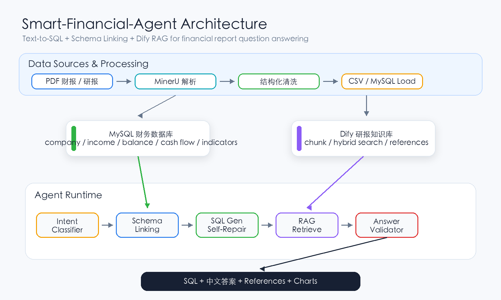
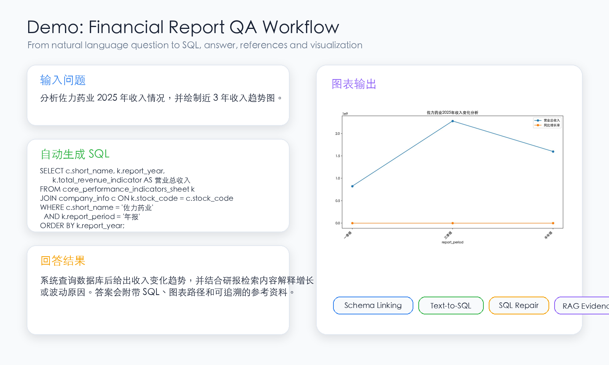

# Smart-Financial-Agent

基于 Text-to-SQL、Schema Linking、Dify RAG 和答案校验的上市公司财报智能问数助手。项目源自泰迪杯赛题实践，适合作为“财报结构化数据 + 研报知识库”的 Agent 示例项目。

## 功能

- 自然语言问题转 MySQL 查询。
- Schema Linking：识别公司、报告期、财务指标和行业过滤条件。
- SQL 自动修复：执行失败后让 LLM 基于错误信息重写 SQL。
- Dify 知识库检索：结合研报内容完成归因分析和开放问题回答。
- 轻量意图分类：先判断是否需要 RAG，减少不必要的 LLM 调用。
- 结果可视化：支持折线图、柱状图、饼图、散点图等。
- 答案校验：检查回答中的关键数值是否来自数据库结果。

## Architecture



## Demo



## 快速开始

1. 安装依赖：

```bash
pip install -r requirements.txt
```

2. 配置环境变量：

```bash
cp .env.example .env
```

然后填写 `.env` 中的 MySQL、通义千问和 Dify 配置。

3. 准备数据库：

根据 [sql/schema.sql](sql/schema.sql) 创建表，并导入你自己的财报结构化数据。当前仓库只保留样例问题和样例输出，完整比赛数据、研报 PDF 和财报数据请自行准备。

4. 运行单题：

```bash
python run_single.py B2001
```

5. 批量运行：

```bash
python run_task3.py
```

默认读取 `examples/questions_sample.xlsx`，输出到 `examples/output_sample.xlsx`。也可以通过环境变量覆盖：

```bash
INPUT_FILE=your_questions.xlsx OUTPUT_FILE=your_output.xlsx python run_task3.py
```

## 关键文件

- [agent.py](agent.py)：主 Agent，包含 Text-to-SQL、RAG、图表和答案生成流程。
- [schema_linker.py](schema_linker.py)：公司、时间、指标、行业的 Schema Linking。
- [intent_classifier.py](intent_classifier.py)：轻量 RAG 意图分类器。
- [answer_validator.py](answer_validator.py)：答案数值一致性校验。
- [db.py](db.py)：MySQL 连接和查询封装。
- [run_single.py](run_single.py)：单题调试入口。
- [run_task3.py](run_task3.py)：批量处理入口。

## 数据说明

本项目不建议公开提交完整比赛附件、研报 PDF 或商业财报数据。推荐做法：

- `examples/`：放少量样例问题、样例知识库 CSV 和样例输出。
- `data/`：放本地完整数据，默认被 `.gitignore` 忽略。
- `sql/`：放数据库建表脚本和少量脱敏样例数据。

## 文档

- [docs/data_pipeline.md](docs/data_pipeline.md)：MinerU、MySQL、Dify 的数据处理流程。
- [docs/database_schema.md](docs/database_schema.md)：数据库表结构说明。
- [docs/open_source_checklist.md](docs/open_source_checklist.md)：发布 GitHub 前检查清单。

## 许可证

代码采用 MIT License。数据、比赛附件、研报 PDF 和第三方模型请遵守各自来源的授权条款。
